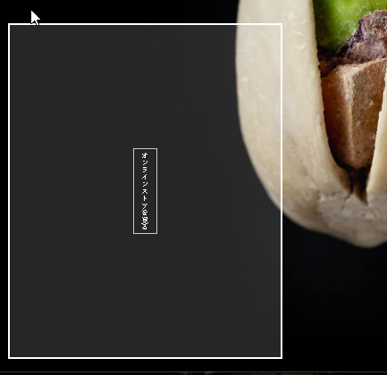
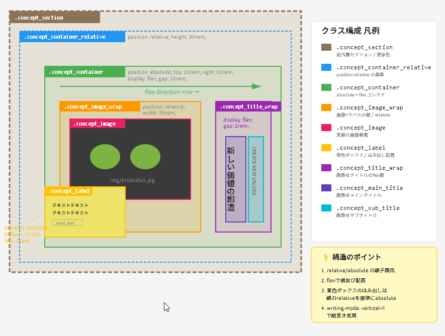
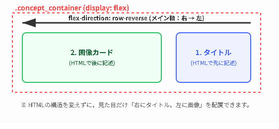
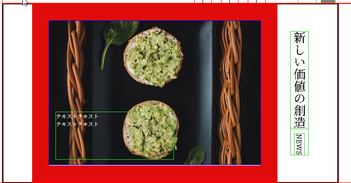
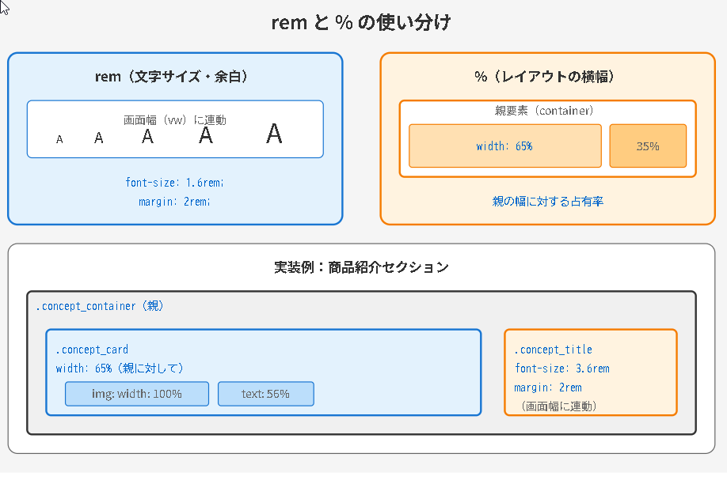
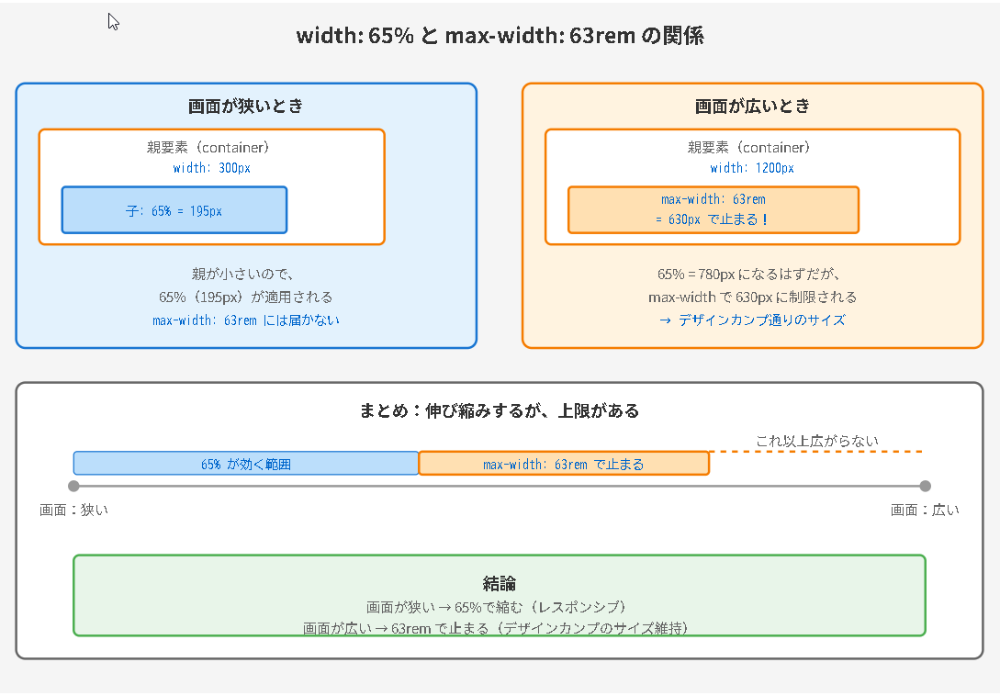
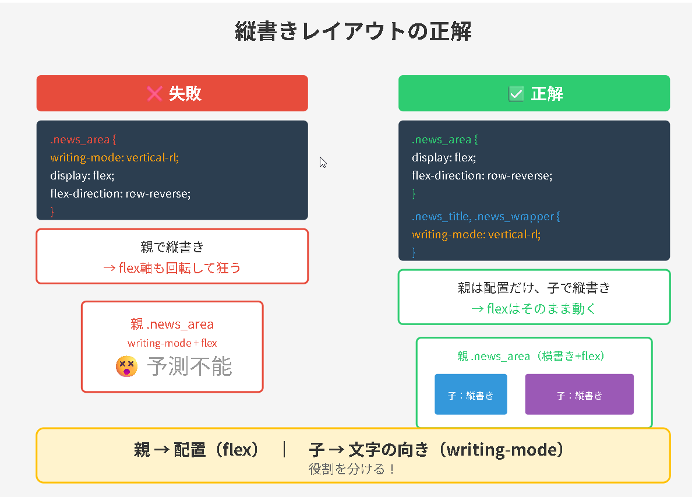
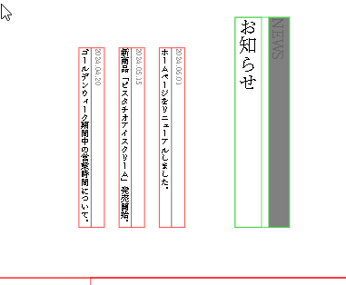

▢ 　背景画像は PC と SP で切り替え（`<picture>`タグ or メディア
切り替えたい場合は以下のように指定する。
background-image: url("../img/mainvisual-pc.jpg");をするときは
普段とちがって ima src と時と違い　../一度上のフォルダに移動する必要がある

▢ 　ＰＣとスマホで画像を変える場合は、HTML でＳＲＣを指定せず
スマホ版で以下のように設定する

<header class="header_area">
.header*area {
background-image: url("../img/mainvisual-pc.jpg");
background-size: cover; /* 要素いっぱいに広げる */
background-position: center; /* 中央基準で表示 */
}

▢ ポジションアブソリュートの使い方
親に relative、子に absolute を設定します。
親（position: relative）└ 子（position: absolute）← 親を基準に配置される
★ 同じ階層でもできる上は間違い → かならず重ねたい要素をリラティブにする。

HTML 構造-------------------------------------------------

<header class="header_area"> <!-- 親 -->
  <nav>
    <!-- ナビゲーション -->
  </nav>
  ★親のメインヘッダに対して、子階層にセットする
  <div class="header_online">  <!-- 子：これを左下に配置したい -->
    <a href="https://example.com" target="_blank" rel="noopener noreferrer">
      オンラインストアを見る
    </a>
  </div>
</header>
---
ポジションリラティブは子要素に書く必要ある。
.header*area {
position: relative; /* ← これがないと absolute が効かない */
}
/* 子：左下に配置 */
.header*online {
position: absolute; /* 親を基準に配置 */
left: 20px; /* 左から 20px */
bottom: 20px; /* 下から 20px */
}
HTML 構造-------------------------------------------------

▢ 　たてがきは writing-mode: vertical-rl;
これは親要素ではなく a タグにかく。

▢ 　 prettier できずいたらすぐ、コパイロットにいってタグをなおしてもらう

▢ 　フレックスは、上にかかれたものから左から順番に記載されることをわすれない。

▢

<ul class="footer_location">
<!-- └ 子フレックス -->
<li class="nav-item">
<a href="#">０ ３ | Ｘ Ｘ Ｘ Ｘ | Ｘ Ｘ Ｘ Ｘ</a>
</li>
<li class="nav-item">
<a href="#">〒 １ ０ ６ | ０ ０ ３ ２ 　 東 京 都 港 区 六 本 木 ５ 丁 目 × × × × ×</a>
</li>
</ul>

nav-item が縦書きにならない
.footer_location {
display: flex;
gap: 3rem;
writing-mode: horizontal-tb;
}

縦書きで「横並び」にしたい時の呪文 CSS 答え
.target {

display: flex;
writing-mode: vertical-rl; /_ 縦書きにする _/
flex-direction: column; /_ 横に並べるための必須スイッチ _/
}

▢ 　 flex 子フレックスで、width を指定すると、flex1 としているより
優先されるため、基本、サイズを指定する必要がない場合は flex1 にきめておくと楽。

ーーーーーーーーーーーーーーーーーーーーーーーーーーーーーーーーーー
自分でデザインカンプ
▢ 　画面をよこにみて、absolute の回数を減らす。(理由、
★Absolute を減らして、流れ（横方向）で作る理由
壊れないから（一番大事）
Absolute は「画鋲で止める」ようなものです。
画面の大きさが変わると、止めた場所がズレてレイアウトが崩壊します。
流れで作れば、画面に合わせて柔軟に動いてくれます。
計算しなくていいから vertical-rl（縦書きモード）を使えば、
h1（ロゴ）の隣に nav（メニュー）が自動的に並びます。

座標を計算して配置する手間がゼロになります。
結論： 「頑張って配置する」のではなく、「勝手に並ぶようにする」のがプロの書き方です。)

header
h1
nav

▢ 　クラスを直接指定する方法
タグ名で省略せず　ネストされたクラス名もかならずかく
a タグにもクラス名をかっく

<div class="online_absolute">
  <a href="#" target="_blank" class="online_link">オンラインストアを見る</a>
</div>

▢ 全体像を把握してまとめてパディングをしかける

▢nav はメインメニューの場合だけ使用する

▢ タイトルなどの項目は親ディブで囲む。また中身は span タグがベスト

<h2 class="section-title">
<span class="ja">新しい価値の創造</span>
<span class="en">Create New Values</span>
</h2>

▢ 　ぜんたいのメインカラーがあれば最初に BODY でいろをぬっておくそうすると section のエリアでマージンボトムしたときも色がつく

▢ 更新した時途中からブラウザで表示したい場合
・URL の最後に、　 about をつける http://localhost:5500/#about
・HTML のセクションで ID をふる

<section id="about" class="concept_area">

▢flex で指定した画像に absolute で文字を配置しようとすると、top bottom などと指定した位置と、表示があわなくなる
Flex だと画像の高さが隣のタイトルに合わせられてしまうので、
align-items: flex-start をかけて高さを画像に合わせる必要がある。

▢ サイズがサイズが違うと思ったら、Style CSS でフォントサイズを 1400px に指定しているのを忘れていた。

※設計者は、 「ヘッダーは文字が流れるだけだから、縦書き設定だけで十分」
「商品はスマホでレイアウトをガラッと変えたいし、画像との位置関係を調整したいから、Flexbox という強力なツールを使おう」
と判断して使い分けた、ということです。

▢ 　インライン要素は、display block
ブロック要素にすることによって、padding、border、width、height が
すべて正確に計算されるようになる。
よく使うインライン要素

<a>: リンク
<span>: テキストのグループ化（装飾用）
<strong> / <b>: 太字
<em> / <i>: 斜体
<label>: フォームのラベル
<small>: 注釈や細目

▢ 　パディングはあくまで中身の文字と文字というか、
要素と外の枠ボックスの距離を取るものである。
もしも自分で分からなくなったら、ボーダーで指定するとイメージが開く。
ボーダーを指定せずに、パディングだけして色だけ指定すると、
枠がない色を作ることができる。



▢「ロゴは `h1` タグ」と書かれたら、h1 タグで囲んで、さらに子要素で画像なり span タグで文字をかくことを意識する。

例

<h1 class="logo">

</h1>

<h2 class="news_title">
    <span class="title_news">News</span>
    <span class="title_notice">お知らせ</span>
</h2>

※文法上の理由: <h2> などの見出しタグの中には、インライン要素（<span> や <a> など）しか配置できません。<div> はブロックレベル要素であるため、見出しの中に入れることは禁止されています。

▢ 　日付とニュースなどの構造を作る際は、

暗記 ★dl だけかけば、vsCode のほうでサジェストするので
dl だけおぼえておく。

`dl` `dt` `dd` タグでマークアップ

  <dl class="news_List">
    <div class="news_part">
      <dt>2021.01.01</dt>
      <dd>タイトルタイトルタイトルタイトル</dd>
    </div>
    <!-- ...他の項目... -->
  </dl>

▢ 　該当の箇所に飛ぶ
http://127.0.0.1:5500/index.html#check
暗記

 <section id="news"

▢ 　 AI にお願いするとき、サンプル SVB


▢GitHub に支持する才能、テンプレート

セクションの画像: 1 画面に収まる範囲のスクリーンショット。
素材（アセット）: 使用する画像ファイル名（例：img/ice-cream.jpg）。
構造の指定: 「ここは dl/dt/dd を使う」「ここは h2 と span の構成」などの指示。

▢FORMAT によって、
セクションごとで
左右逆に全く同じデザインなんだけど、
flex-direction: row-reverse; を使用する。



▢Position: absolute;をする場合、

前 ■ position: absolute の親子関係とサイズの一致
画像を基準にテキストを配置したい場合、画像そのものではなく、画像とテキストを包む「親ボックス」を基準点（relative）にするのが鉄則です。

1. 構造の考え方
   親ボックス（.concept_card）は、中にある画像（.concept_img）のサイズに合わせて自動的に伸縮します。そのため、「親の枠」と「画像の枠」は基本的に一致します。

メリット: 画像に直接 absolute をかける必要がなく、レイアウトが崩れにくい。
ポイント: relative は「コンセプトイメージ」ではなく「親のカード」に実施する。

2. 実装コード
   <!-- 親：ここで relative を実施する（基準点） -->
   <div class="concept_card">
     
     <!-- 子：親を基準に自由に移動する -->
     <p class="concept_text">テキストテキスト</p>
   </div>

```css
.concept_card {
position: relative; /_ 親：基準点 _/
}

.concept_text {
width: 35rem;
height: 14rem;
position: absolute; /_ 子：親を基準に浮く _/
bottom: 2rem;
left: 2rem;
}

```

3. なぜサイズが一致するのか
   親要素が「ピッタリ重なっている」ように見えるのは、親要素が子要素（画像）のサイズに合わせて伸縮する性質を持っているからです。

この性質を利用することで

、画像からの距離を測るのではなく、親ボックスからの距離を指定するだけで、意図した位置（左下など）にテキストを正確に配置できます。



▢ 　大事　暗記　パーセントとレムの使い分け

使い分けの目安：

文字サイズや余白: rem（画面に合わせて自動拡大縮小）
レイアウトの横幅（カラム）: %（親要素の中での占有率を決定）


▢ 　問題：
仕様書で「幅は % 指定」と言われたけど、% にするとデザインカンプとサイズがズレる。

理由：
% は「親の箱の中で何割を占めるか」を決めるだけで、「画像の大きさ」そのものは制御できないから。

解決策：
% と max-width（rem）を同時に指定する。

```css
.concept_card {
  /* 親の中での占有率（仕様書の指示） */
  width: 65%;

  /* 画像の最大サイズをロック（カンプ通りのサイズ） */
  max-width: 63rem;
}
```



「細かい数字」ではなく「見た目のバランス」を守るのがレスポンシブの鉄則です。

▢ 　分かった一番重要なこと　暗記

まず、
width 100％　
max-width: 140rem
max-width を指定する理由としては
前段のスタイル.css とかで

```css
html {
  font-size: calc(10 / 1400 * 100vw);
  /* 画面幅1280pxで10px*/
}
```

これがないことを想定している。
なぜならば、一緒にサイズが伸びてしまうからあまり意味がない。

もしもスタイルＣＳＳで上記の記述があるならば、以下をしていけばいい。

```css
html {
  /* 10px と 計算値のうち、小さい方が採用されます */
  font-size: min(10px, calc(10 / 1400 * 100vw));
}
```

▢ 拡張ツールの見方　暗記
紫・・・その紫色の部分は、justify-content: center; によって生じている Flexbox の余白（整列スペース） です。

▢ 　マージンとパディングの違い
暗記
親要素から見れば、子要素はパッディングで設定する。子要素同士から見れば、マージンで他の距離を取る。

つまり。おやで最初にパディングを
とるのがわかりやすい。

▢ 　 📝 縦書きレイアウトの失敗メモ　暗記

❌ 失敗パターン（親で縦書き）

```css
.news_area {
  writing-mode: vertical-rl; /* 親に設定 */
  display: flex;
  flex-direction: row-reverse;
}

何が起きる： flexの軸も一緒に回転して、配置が予測できなくなる


✅ 正解パターン（子だけ縦書き）　

css
/* 親：横書きのまま、配置だけ制御 */
.news_area {
  display: flex;
  flex-direction: row-reverse;
}

/* 子：文字だけ縦書き */
.news_title,
.news_wrapper {
  writing-mode: vertical-rl;
}
```

**なぜ良い：** flex は普通に動く、中の文字だけ縦になる

---

### 🎯 覚え方

```
親 → 配置（flex）
子 → 文字の向き（writing-mode）

役割を分ける！
```



▢ 　うっかりミス
子要素が一つだけなのにフレックスをかけてしまった。

▢ 　手書きの図形の書き方

手書きメモの形式

・画面に情報を混在させず、画面下に「クラス名」を記載し「プロパティ」を書くスタイルに統一します。

▢ 　パディング のかけかた
覚え方
（余白の目的）　　　　（使うもの全体に）
共通の余白　　　　　　親の padding
子ごとに違う余白　　　子の margin

今回は「他と合わせる」より「実際の構造に合わせる」が優先二重管理を避けた方が、3 ヶ月後の自分が楽です！

以下の場合は、右と下だけパディングをつける。
それ以外は、子でマージンで別々に管理する。


▢ 　 writing-mode: vertical-rl
これをかけることによって見方がかわる。flex direction :column;が横配置など

▢ 　うっかりミス

見た目が、自分の想定と違うと思った、デザインカンプ 1400px に対して、wrapper でサイズを max-with1200 にしていた。

-----------------------------↑ 上記追記済み　 GitHub インストラクションに

▢ メディアクエリ

▢ git 個人メモ、★github ルールに追加する必要なし

git の紐づけ

```
git remote add origin https://github.com/あなた/リポジトリ.git

git branch -M main
git push -u origin main

```
